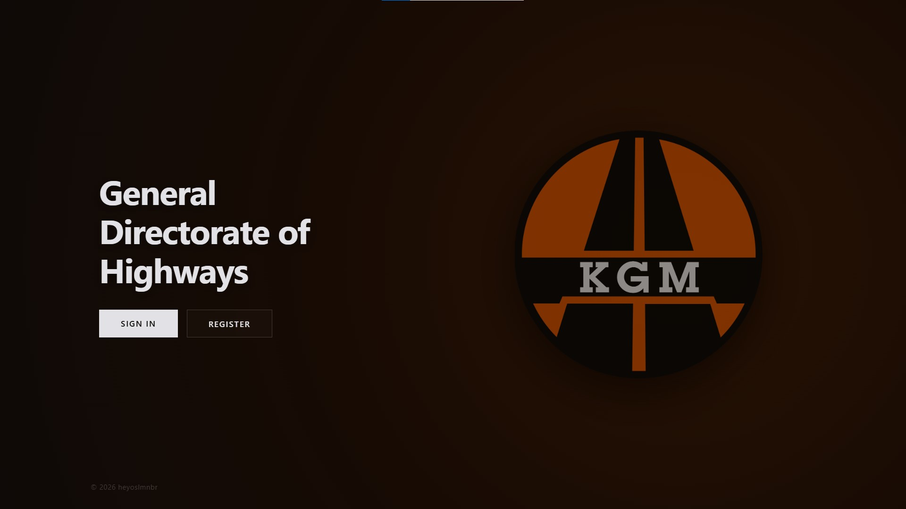
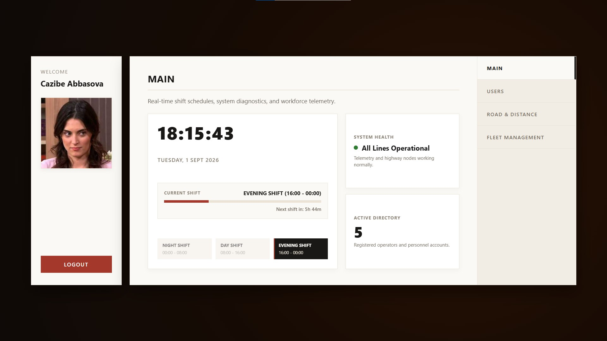
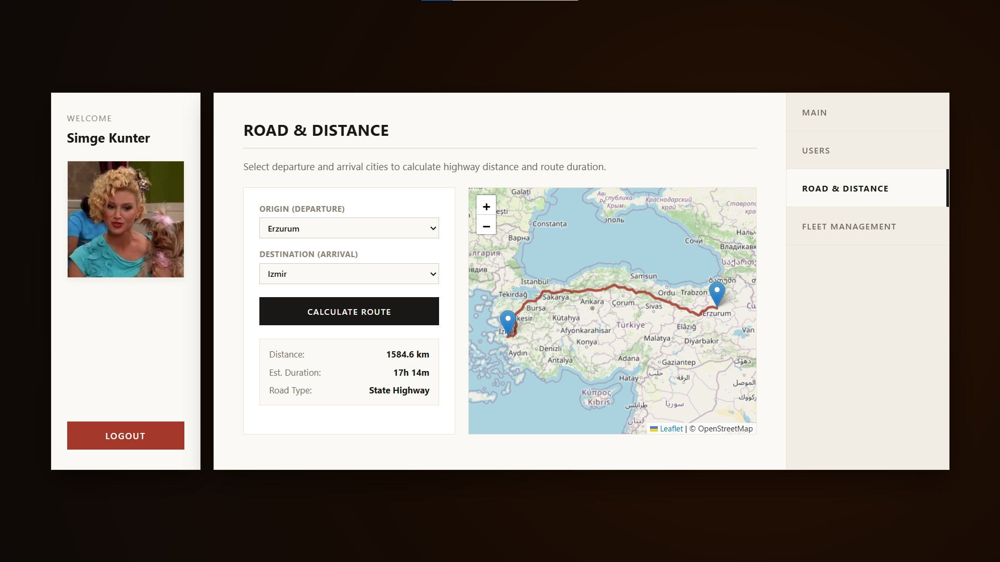
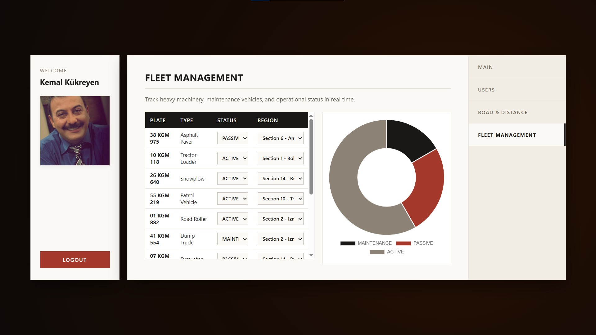
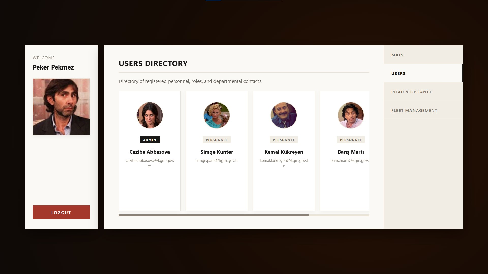

# karayollari internship deliverables
tracking my summer internship deliverables at turkiye general directorate of highways

## Repository Overview

* `kgm-mock-web-app/` - a java spring boot mock web application simulated for a government institution, built as an educational case study.
* `excel-vba-case-tracker-app/` - automated case tracking system and a detailed LaTeX report of it
* `excel-vba-employee-management/` - interactive dashboard to query employee seniority and leave entitlement schedules
* `internship-report.pdf` - internship report document

## KGM Mock Web Application

### Preview

| Landing Page |
| :---: |
|  |
| *login screen with role-based auth* |

| Main Dashboard | Distance Calculator |
| :---: | :---: |
|  |  |
| *live 3-shift clock and system status* | *route and distance calculation between cities* |

| Fleet Management | Users Directory |
| :---: | :---: |
|  |  |
| *vehicle status tracking and chart breakdown* | *registered personnel list* |

### Quick Start

1. update db credentials in `kgm-mock-web-app/src/main/resources/config.json`

```json
{
  "db_url": "jdbc:mysql://localhost:3306/kgm",
  "db_user": "root",
  "db_password": "password",
  "RESET_SCHEMAS_ON_EACH_LAUNCH": true,
  "IF_RESET_FILL_MOCK_DATA": true
}
```

2. build and run

```bash
cd kgm-mock-web-app
mvn spring-boot:run
```

3. visit `http://localhost:8080`
   * default credentials are `admin` for both username and password
