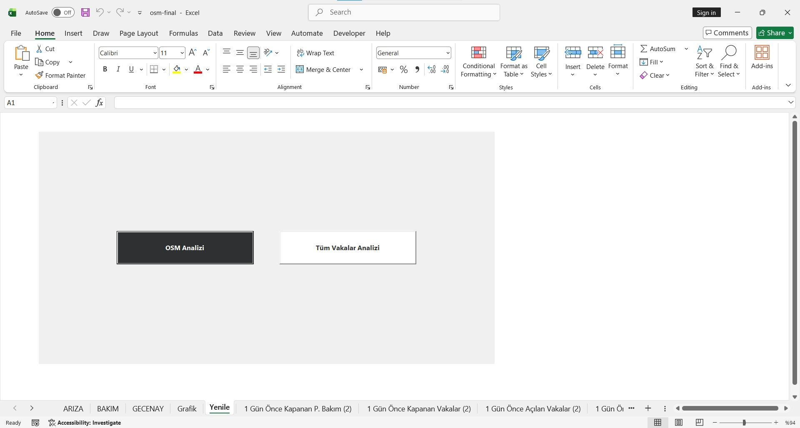
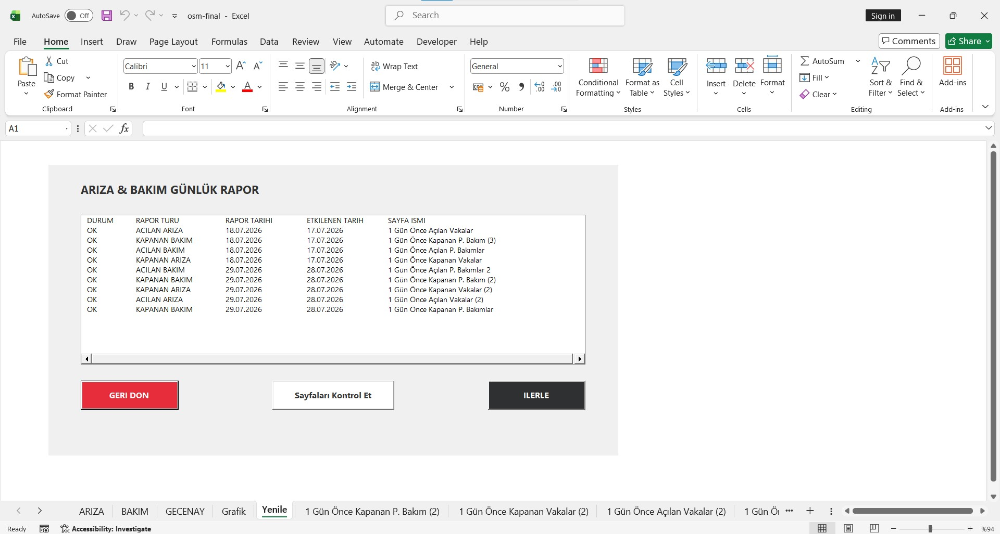
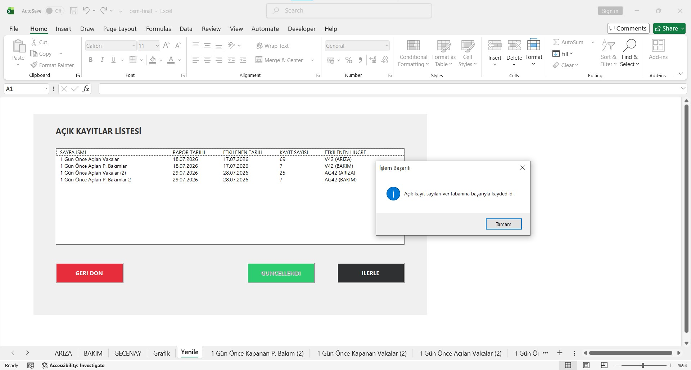
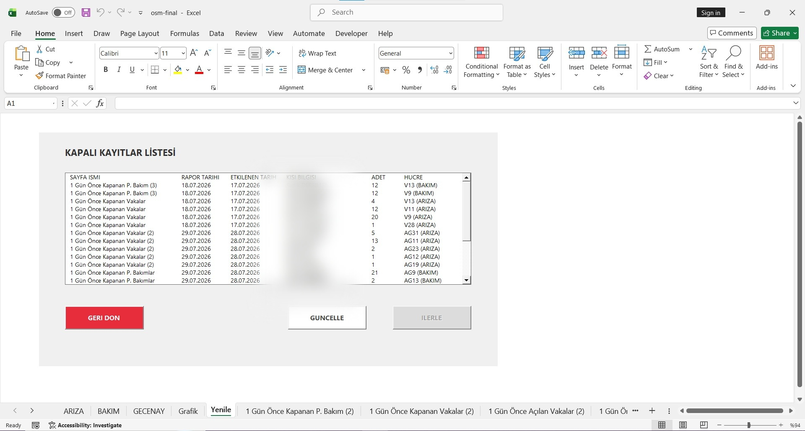

# Excel VBA Case Tracker App

check out the detailed report.

This folder contains the VBA source code components for the Excel application as well as the LaTeX source code for the documentation report.

---

> **Note on Confidentiality:**  
> This repository is maintained strictly for **version control and code tracking**. The actual Excel workbook contains sensitive company data and is kept private, meaning the code cannot be executed as a standalone application.

---

## Screenshots

## Directory Structure

* **`app-source-code/`**: Contains the VBA source code components for the Excel application.
  * **`vba-files/`**: Contains modularized VBA files divided into `Class` and `Module` subdirectories.
* **`report-source-code/`**: Contains the LaTeX source code files used to generate the project report and documentation.

---

## Setup Instructions

### Option 1: Manual Copy-Paste
1. Open your target Excel file.
2. Press **`ALT + F11`** to open the VBA Editor window.
3. Manually copy and paste the code components into their respective modules/classes.

> **Important:** When copying the code, start copying from the `***************************` line downwards. **Do NOT** copy any code or lines above this line to avoid syntax errors.

After completing the manual setup, your VBA project structure should look like this:

### Option 2: Using the XVBA Extension
If you are using the **XVBA - Live Server VBA** extension, use the files located inside the `app-source-code/vba-files` directory.

---

## Special Character Notice (Encoding Issue)

Due to character encoding behavior when transferring files via the Live Server extension, non-ASCII or Turkish characters may not display correctly after import/export.

**Correction Step:** After importing or exporting via XVBA, manually copy and paste the raw content of `mod_Config.bas` to preserve non-ASCII / Turkish characters correctly.