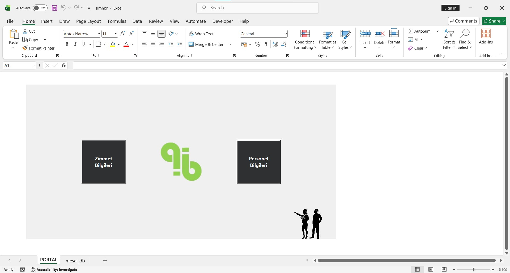
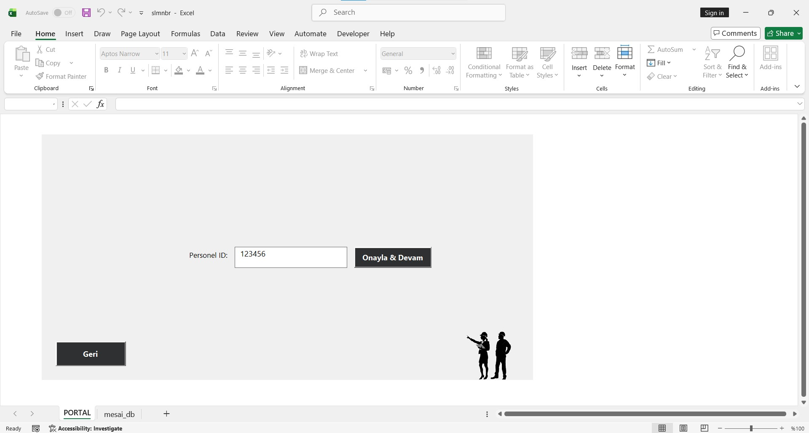
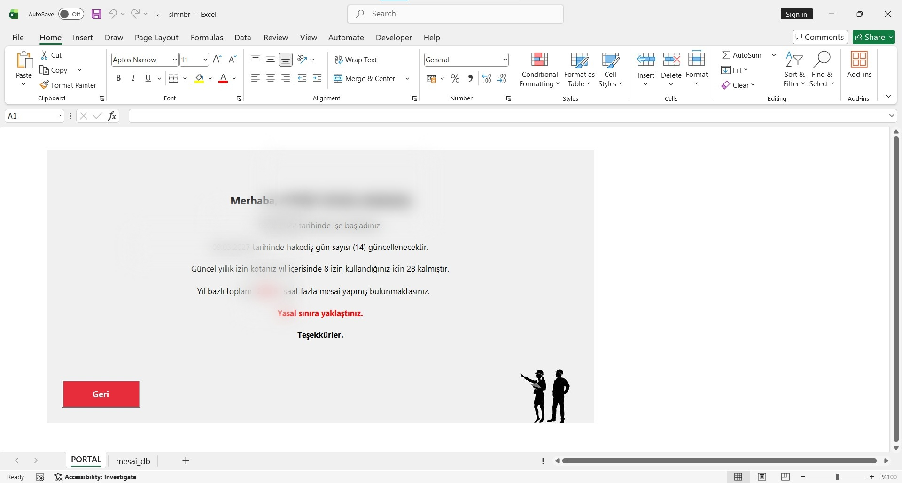

# Employee Management (Excel VBA)

An Excel VBA-based automation system for employee leave balances, entitlement schedules, and overtime tracking.

---

> **Note on Confidentiality:**  
> This repository is maintained strictly for **version control and code tracking**. The actual Excel workbook contains sensitive company data and is kept private, meaning the code cannot be executed as a standalone application.

---

## Screenshots

